# Roland LiveStage | JUNO-D

Aplicativo Android para organização e controle de cenas, presets de Parts e playlists para performance ao vivo com o Roland JUNO-D via USB-MIDI.

> Projeto independente, desenvolvido por Erick W. Miguel.  
> Não é afiliado, patrocinado ou endossado pela Roland Corporation.

## Funciona 100% offline

- Não requer internet, conta de usuário ou servidor remoto.
- Todos os dados (cenas, presets e playlists) são armazenados localmente no dispositivo.
- Ideal para uso em **modo avião** no palco, evitando notificações, chamadas e distrações.
- Basta conectar o JUNO-D via USB-OTG e usar o app normalmente, mesmo sem rede.

## Recursos

- Gerenciamento de cenas USER do JUNO-D
- Leitura da cena atual diretamente do teclado via USB-MIDI
- Organização de cenas com nomes personalizados
- Criação e edição de presets de Parts
- Aplicação rápida de presets durante a performance
- Modo Performance com pads de acesso rápido
- Criação, organização e execução de playlists
- Inclusão, remoção e reordenação de cenas dentro de playlists
- Navegação entre cenas de uma playlist
- Temas Standard White e Standard Dark
- Dados salvos localmente no dispositivo

## Requisitos

- Dispositivo Android compatível com USB-OTG
- Cabo ou adaptador USB-OTG compatível
- Roland JUNO-D conectado via USB-MIDI
- Android com suporte à API MIDI

## Como funciona

1. Conecte o JUNO-D ao dispositivo Android por USB-OTG.
2. Atualize os dispositivos MIDI na tela principal.
3. Crie uma cena manualmente ou leia a cena atual do JUNO-D.
4. Crie presets definindo as Parts que devem permanecer ativas.
5. Organize cenas em playlists para o repertório.
6. Entre no Modo Performance para trocar cenas e aplicar presets com rapidez.

## Modos de uso

### Cenas

Uma cena representa uma USER SCENE do JUNO-D associada a um nome no aplicativo. Cada cena pode conter vários presets de Parts.

### Presets

Presets registram quais Parts devem ficar ativas ou desativadas. Eles podem ser aplicados rapidamente no Modo Performance.

### Playlists

Playlists organizam cenas na ordem do repertório. É possível adicionar, remover e mudar a ordem das cenas para preparar uma apresentação.

### Modo Performance

O Modo Performance oferece acesso rápido à cena atual, navegação entre cenas de uma playlist e pads para aplicação dos presets disponíveis.

## Armazenamento

As cenas, presets e playlists são armazenados localmente no dispositivo. O aplicativo não depende de conta de usuário nem de servidor remoto.

## Tecnologias

- Java
- Android SDK
- Android MIDI API
- Gradle

## Capturas de tela

### Ícone e splash

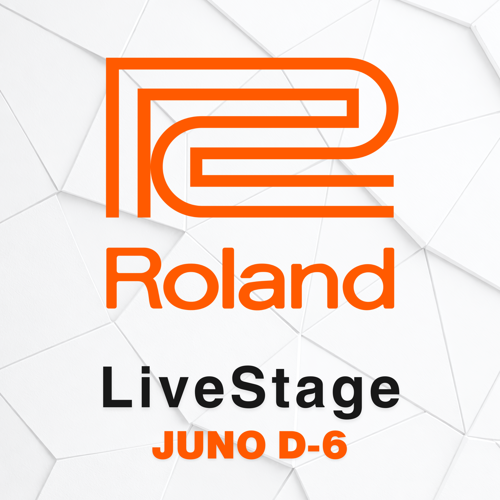

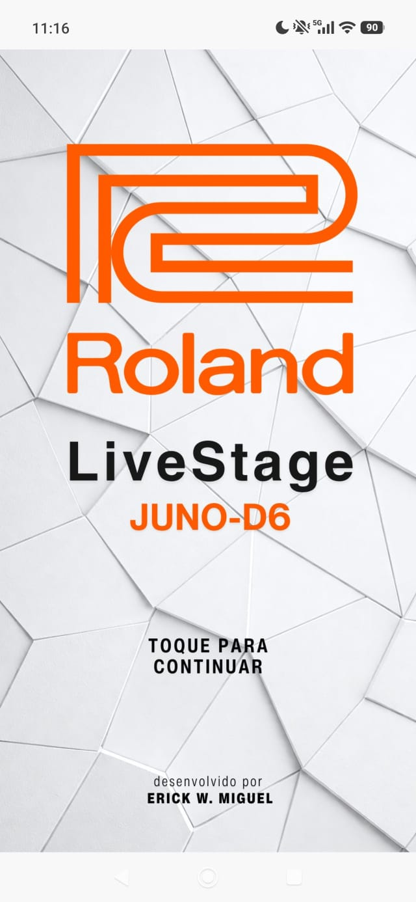
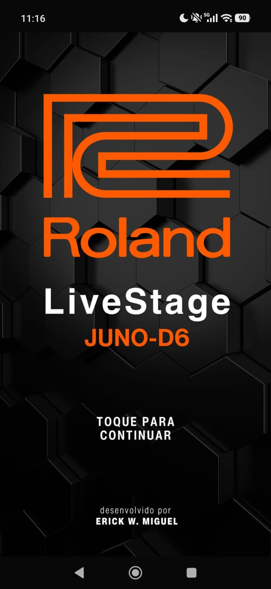

### Tela principal

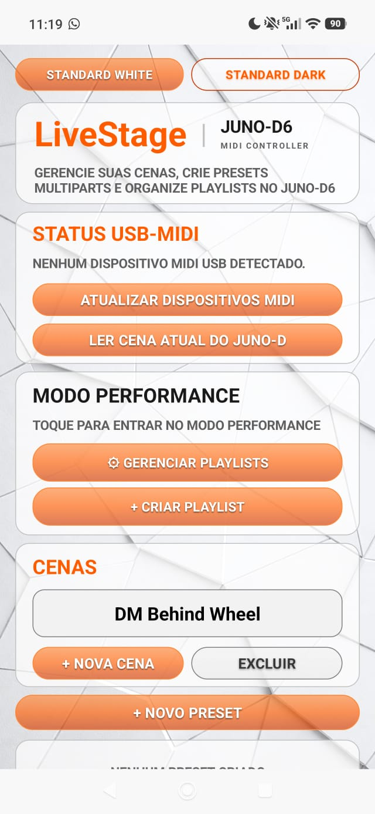
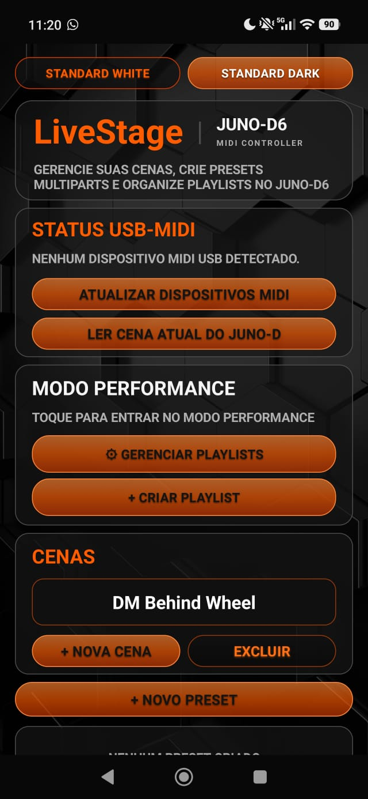

### Leitura de cena atual

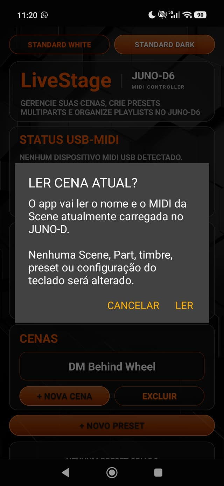

### Playlist Mode e Performance Mode

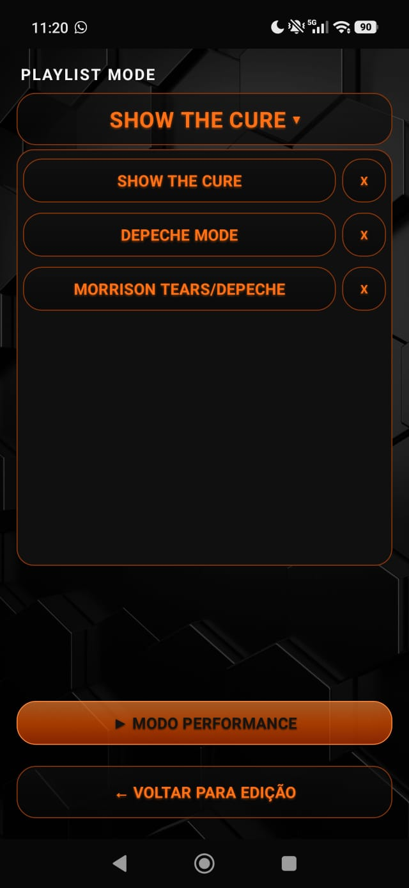
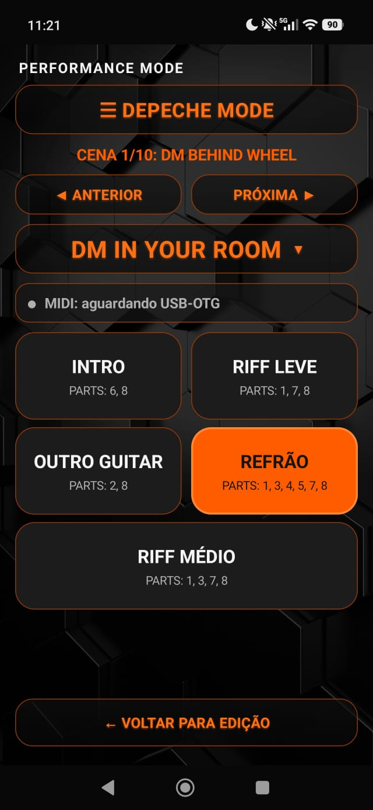

### Criação e edição

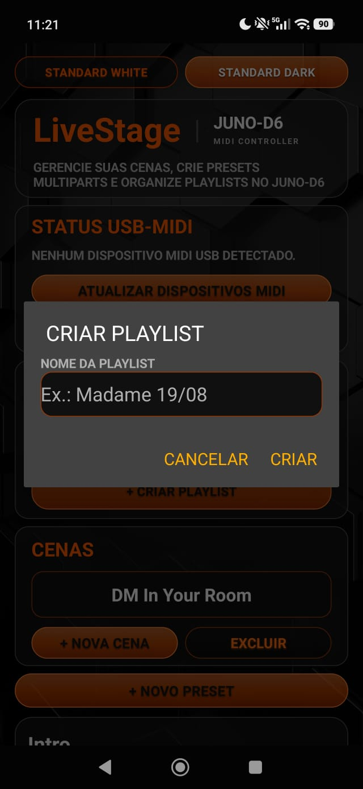
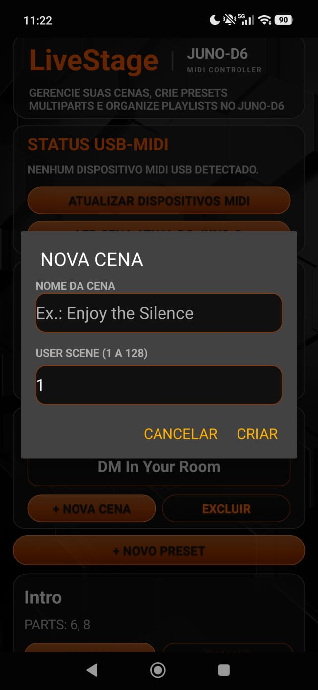
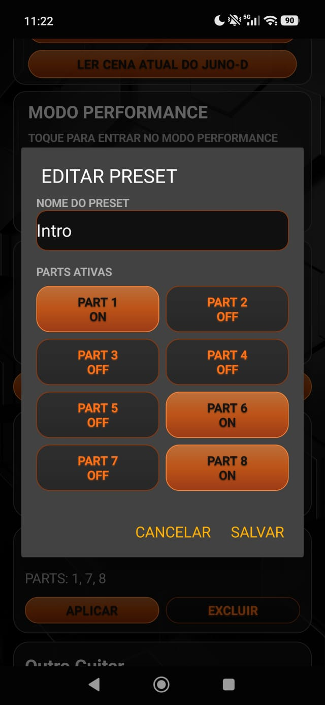

## Aviso sobre marcas

Roland e JUNO-D são marcas pertencentes aos seus respectivos proprietários. Este projeto é independente e não possui vínculo oficial com a Roland Corporation.

## Autor

Desenvolvido por **Erick W. Miguel**.